# Flux

Flux is a real-time telemetry pipeline workspace: `flux-producer` emits compact
binary UDP packets, `flux-server` aggregates them into rolling summaries, and
`flux-dashboard` renders the live stream in a terminal UI over WebSocket.


## Architecture

```mermaid
flowchart LR
    classDef producer fill:#eaf3ff,stroke:#2f6feb,stroke-width:1.5px,color:#0f1f33
    classDef server fill:#eefbf3,stroke:#1a7f37,stroke-width:1.5px,color:#10281a
    classDef dashboard fill:#fff4e5,stroke:#b26a00,stroke-width:1.5px,color:#3d2a00
    classDef config fill:#f6f8fa,stroke:#8c959f,stroke-width:1px,color:#24292f

    subgraph P["flux-producer"]
        PC["TOML metric config"]
        PE["Per-metric emitter tasks"]
        PP["FluxPacket encoder"]
        PC --> PE --> PP
    end

    subgraph S["flux-server"]
        SI["UDP ingress"]
        SA["Rolling metric store"]
        SH["Pipeline health"]
        SB["Snapshot broadcaster"]
        SI --> SA
        SI --> SH
        SA --> SB
        SH --> SB
    end

    subgraph D["flux-dashboard"]
        DW["WebSocket client"]
        DU["ratatui dashboard"]
        DR["Reconnect + staleness UX"]
        DW --> DU
        DW --> DR
    end

    PP -->|"UDP · FluxPacket"| SI
    SB -->|"WebSocket · Snapshot JSON"| DW

    class PC config
    class PE,PP producer
    class SI,SA,SH,SB server
    class DW,DU,DR dashboard
```



The default producer runs three built-in demo metrics with no flags. The server
listens on UDP `0.0.0.0:9000`, exposes WebSocket snapshots on
`ws://127.0.0.1:9001/ws`, and the dashboard reconnects automatically if the
server restarts.

## Quickstart

Run these commands from the workspace root:

```bash
cargo run -p flux-server
```

```bash
cargo run -p flux-producer
```

```bash
cargo run -p flux-dashboard
```

Use `q` to quit the dashboard. Use `?` for the in-app keymap and `/` to filter
metrics by substring.

If you want the three-pane demo layout, run:

```bash
./scripts/demo.sh
```

## Why Binary UDP + JSON WebSocket?

The producer-to-server hop is optimized for high-frequency ingest: fixed-layout,
big-endian binary packets keep bandwidth, parsing overhead, and allocation
pressure low. The server-to-subscriber hop is optimized for operability: JSON
snapshots over WebSocket are easy to inspect, easy to consume from non-Rust
clients, and let dashboards subscribe to summaries instead of raw packet floods.

## Configuration

- [Configuration reference](docs/config.md)
- [Packet format specification](spec/packet.md)
- [Example producer config](config/producer.example.toml)

## Build, Test, Lint

```bash
cargo build --workspace
```

```bash
cargo test --workspace
```

```bash
cargo clippy --workspace --all-targets -- -D warnings
```

```bash
cargo fmt --all --check
```
